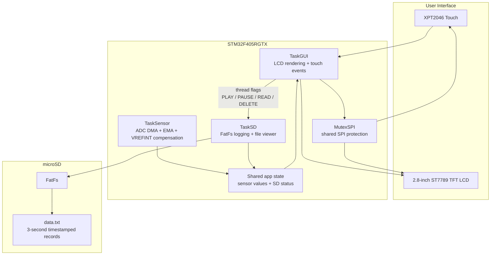

# Real-Time STM32 Data Logger with Touch LCD and SD Storage

> STM32F405 + FreeRTOS embedded data logger with ADC-DMA acquisition, touch LCD control, SDIO/FatFs logging, and on-device historical data viewing.

This project was built as an embedded systems course project. The goal was to move beyond a simple peripheral demo and build a complete embedded workflow: sample data in real time, show live values on an LCD, let the user control logging through touch input, persist records to a microSD card, and read the logged data back on the device.

---

## Architecture



---

## Features

| Area | Implementation |
| --- | --- |
| RTOS task split | Sensor acquisition, GUI handling, and SD-card operations run in separate FreeRTOS tasks through CMSIS-RTOS v2. |
| ADC acquisition | ADC DMA samples internal temperature, VREFINT, and an external analog channel. |
| Signal processing | EMA filtering is applied to reduce display/logging noise; VREFINT calibration is used to compensate ADC-derived temperature. |
| Touch LCD UI | Play/Pause control, live sensor display, SD status panel, and paginated data viewer are rendered directly on the TFT LCD. |
| SD-card logging | In PLAY mode, `TaskSD` appends timestamped records to `data.txt` every 3 seconds. |
| Historical viewer | In PAUSE mode, logged records are shown newest-first with page navigation and a clear-data action. |
| SD-card recovery | The firmware handles mount states, reports status/error codes on the LCD, and can auto-format a blank card as FAT32. |
| Shared SPI bus | The LCD and touch controller share SPI1 with chip-select management, SPI speed switching, and an RTOS mutex. |

---

## Hardware Setup

| Module | Detail |
| --- | --- |
| Development board | Waveshare Open405R-C |
| MCU | STM32F405RGTX, ARM Cortex-M4F |
| Display | 2.8-inch SPI TFT LCD, ST7789-compatible driver path |
| Touch controller | XPT2046 resistive touch controller |
| Storage | microSD card over SDIO with FatFs |
| Analog input | ADC channel on PC0 for external/test-board input |
| Clock / time | RTC used for timestamp formatting; no backup battery in the tested setup |

---

## Data Flow

```text
[ADC DMA buffer]
      |
      v
[TaskSensor]
  - read raw ADC channels
  - apply EMA filtering
  - compute compensated chip temperature
      |
      v
[Shared app state] <------ [TaskSD updates SD status]
      |
      v
[TaskGUI]
  - render live values
  - handle touch buttons
  - request SD actions via thread flags
      |
      v
[TaskSD]
  - mount / format SD card
  - append records every 3 seconds
  - read latest lines for Data Viewer
```

---

## Log Format

When logging is enabled, records are appended to `data.txt`:

```text
HH:MM:SS|DD/MM/YYYY|XX.X C|T:XXXX|A:XXXX
```

Where:

- `XX.X C`: compensated internal chip temperature
- `T`: raw ADC value associated with the temperature channel
- `A`: raw ADC value from the external analog input

---

## Repository Structure

```text
.
|-- Core/                 # Application source, main firmware, RTOS tasks
|-- Drivers/              # STM32 HAL and CMSIS drivers
|-- FATFS/                # FatFs app and target glue code
|-- LCD28/                # LCD/touch driver adaptation
|-- Middlewares/          # FreeRTOS and FatFs middleware
|-- docs/
|   |-- course_report.pdf # Full course report with design and test evidence
|   `-- touch_guide.md    # Notes on XPT2046 touch and shared SPI handling
|-- doan.ioc              # STM32CubeMX configuration
|-- STM32F405RGTX_FLASH.ld
`-- STM32F405RGTX_RAM.ld
```

---

## Build and Flash

### Requirements

- STM32CubeIDE
- STM32CubeMX project support
- STM32F405RGTX target board
- microSD card

### Steps

1. Open STM32CubeIDE.
2. Import this directory as an existing STM32CubeIDE project.
3. Confirm that `doan.ioc` targets the STM32F405RGTX board configuration.
4. Build the project.
5. Flash the firmware to the STM32F405RGTX target.
6. Insert a FAT32 microSD card, or allow the firmware to auto-format a blank card.

---

## Validation Summary

The course report documents these working functions:

| Test item | Result |
| --- | --- |
| Live LCD display for chip temperature and ADC values | Passed |
| Play/Pause touch interaction | Passed |
| Periodic SD-card logging every 3 seconds | Passed |
| Paginated LCD viewer with newest records shown first | Passed |
| Clear-data flow from the LCD UI | Passed |
| SD-card status/error display | Passed |
| SD auto-format flow for blank cards | Passed |

See [docs/course_report.pdf](docs/course_report.pdf) for screenshots and the full report.

---

## Key Technical Notes

- `TaskSD` uses thread flags for control events instead of sending large messages between tasks.
- LCD and touch share SPI1, so touch reads lower the SPI baud rate while LCD drawing uses a faster setting.
- Touch input uses median filtering and stability-span checks to reject noisy samples.
- Data Viewer reads logged records and shows the newest entries first, which is more useful during live testing.
- SD status is intentionally shown on the LCD so hardware/file-system issues can be debugged without a serial console.

---

## Lessons Learned

| Issue | Root cause | Fix / design decision |
| --- | --- | --- |
| Touch coordinates were unstable at high SPI speed | XPT2046 cannot be read reliably at the same speed used for LCD drawing | Added dynamic SPI baud-rate switching before touch transactions |
| Touch panel had an unreliable area | Physical issue on the tested LCD module | Moved critical UI buttons into safer zones and used wider hit margins |
| SD-card state was hard to debug | File-system errors were not visible to the user | Added explicit LCD status codes such as checking, formatting, ready, OK, and error |
| Viewer needed to be useful during demos | Raw append order puts old data first | Implemented newest-first paginated display |

---

## Known Limitations

- The internal STM32 temperature sensor measures chip junction temperature, not ambient temperature.
- RTC time is initialized from build time because no backup battery is used.
- `data.txt` is append-only; file rotation is not implemented.
- Touch calibration is currently fixed for the tested hardware.

---

## Possible Improvements

- Add an external temperature sensor such as DS18B20, LM35, or BME280.
- Stream live data to a PC over USB CDC/UART for plotting.
- Add file rotation by date or maximum file size.
- Add an LCD-based calibration screen for touch coordinates and sensor offsets.
